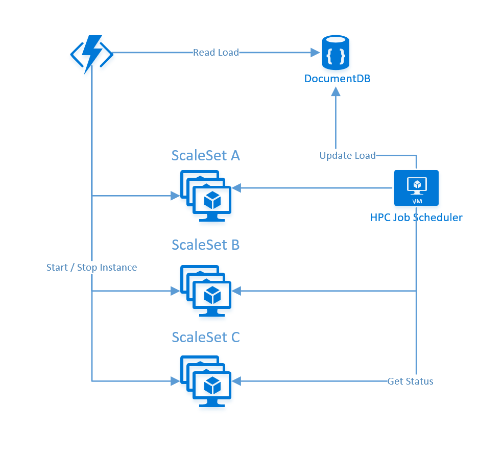

Table of Contents
=================
* [Autoscaling VM Scale Set by Instance](#autoscaling-vm-scale-set-by-instance)
* [Requirements](#requirements)
* [Deployment](#deployment)
* [The PintaScaler Function](#the-pintascaler-function)
* [Updating the load](#updating-the-load)
* [PBS Pro agent](#pbs-pro-agent)

# Autoscaling VM Scale Set by Instance
VM Scale Set autoscaling capabilities that already exists, allows you to scale in or out by defining metrics like explained in this [documentation](https://docs.microsoft.com/en-us/azure/virtual-machine-scale-sets/virtual-machine-scale-sets-autoscale-overview). This is great when all VMs running in the set are doing the same job, but when it comes to HPC scenarios in which the resource manager has to control exactly which VMs needs to be started/stopped, then the technics describe above cannot be used.

The current solution build here is fully generic and based on the work done in the [Azure VMSS Custom Auto Scale repo](https://github.com/zivshtaeinberg/AzureVmssCustomAutoScale)

The overall component flow is this one :
* The __autoscaling Azure Function__ reads the current load from a shared __Cosmos DB__ store
* Based on the load __VM instances__ in the target VM scalesets are __started__ or __stopped__
* on the resource manager side (here an __HPC Job Scheduler__ ), an agent is monitoring the load and usage of __VM instances__ and update their statuses into the shared __Cosmos DB__ store.

# Requirements
* [Create](https://docs.microsoft.com/en-us/azure/cosmos-db/create-documentdb-dotnet#create-a-database-account) a Cosmos DB account, a collection will be added automatically later
* [Register](https://docs.microsoft.com/en-us/azure/active-directory/active-directory-app-registration) a new application in Azure Active Directory
* [Create](https://docs.microsoft.com/en-us/cli/azure/create-an-azure-service-principal-azure-cli) and Azure Service Principal to be reused by the Azure Function
* Grant the application the "Owner" role on the Resource Groups or VMSS to be managed
* Visual Studio 2015
* one of more VMSS with VM instances (started or stopped)

# Deployment
* Open the solution in Visual Studio 2015 Update 3
* Build
* Publish the project named __Pinta.AutoScaling.Functions__ into an Azure Function App resource
* Add entries into the application settings from the "Function Apps / Platform Features / Application settings" blade. Add these Cosmos DB settings key/value pairs :
  * __endpoint__
  * __authKey__
  * __database__
* Start the **PintaScaler** function
* Create a configuration document as explained in [The PintaScaler Function](The PintaScaler Function)

# The PintaScaler Function
This function is called every 10 minutes, you can adjust this value in the _function.json_ file or thru the portal. 10 minutes has been choose to keep enough time for the VM instances to start/stop.

The function reads the pools of VM scaleset to monitor from the Cosmos DB __ClusterLoad__ collection (one per subscription), in which the list of couple (ResourceGroup, VMSS Name) will be retrieved. You will have to set the service principal information used to authenticate the scaler code.

The document format is the following one :

    {
    "id": "unique_id",
    "Type": "pools",
    "SubscriptionId": "your_subscription_id",
    "TenantId": "your_tenant_id",
    "ClientSecret": "your_secret",    "ClientId": "your_client_id",
    "RgVmssName": [
      "RG1,VMSSA",
      "RG1,VMSSB",
      "RG2,VMSSA"
      ]
    }

> The scaling logic implemented in the function is this one. For each VM Scaleset monitored, retrieve the number of VMs required by jobs, if any are missing, try to start the required VMs, up to the Scaleset quota. If VMs needs to be stopped, only those idle from jobs are stopped.

# Updating the load
The HPC cluster load (jobs and nodes) needs to be mapped to the VMSS instances requirements thru two Cosmos DB documents, one for jobs one for VMs.

The information needed from a Job Scheduler point of view are :
  * for each job in a queue (mapped to a scaleset), how many nodes (VMs) are required
  * for each node being registered, what is the status (Free or Busy)

One Cosmos DB document is created in the ClusterLoad collection for each running jobs. The queue name is in fact the Scale Set name. The Job status is one of these : Finished, Hold, Queued, Failed, Running or Unknown. Nodes is the number of nodes required to run the job. Here is the JSON format of this document :

    {
      "Type": "jobs",
      "id": "4716",
      "Nodes": "8",
      "Status": "Hold",
      "QueueName": "pinta00",
      "SchedulerId": "4716"
    }

One Cosmos DB document is created in the ClusterLoad collection for each node. The JobStatus can be either Free or Busy. The PoolName is the same that the job queue and is mapped to the ScaleSet in which the VM is provisioned. Here is the JSON format of this document :

    {
      "Type": "vms",
      "JobStatus": "Free",
      "Name": "pinta007y000001",
      "PoolName": "pinta00",
      "id": "pinta007y000001"
    }

# PBS Pro agent
A sample implementation for PBS Pro is provided in this repo, this agent is based on Python and can be easily cloned for other schedulers if needed.

## Requirements
* Python 2.7.x or 3.5.x
* pydocumentdb python package : pip install pydocumentdb
* azure-storage python package : pip install azure-storage
* Create one queue per VM Scale set, as this is the logical mapping

## Setup
* copy all the .py files somewhere on the PBS Pro job scheduler machine
* update the config.py file with your values
* start the agent by running : python PBSPro.AutoScaling.py

A log file named autoscaling.log with trace like these ones :

	2017-07-04 14:35:33,101 | INFO | root | processing queue pinta00
    2017-07-04 14:35:33,102 | INFO | root | cleaning jobs
    2017-07-04 14:35:33,102 | DEBUG | root | select * from ClusterLoad l where l.Type='jobs' and l.QueueName='pinta00'
    2017-07-04 14:35:33,282 | INFO | root | 0 jobs deleted
    2017-07-04 14:35:33,282 | INFO | root | cleaning nodes
    2017-07-04 14:35:33,282 | DEBUG | root | select * from ClusterLoad l where l.Type='vms' and l.PoolName='pinta00'
    2017-07-04 14:35:33,289 | INFO | root | 0 nodes deleted
    2017-07-04 14:35:33,349 | INFO | root | 0 jobs listed
    2017-07-04 14:35:33,372 | INFO | root | 0 nodes listed
    2017-07-04 14:35:33,460 | INFO | root | wait 2mn
